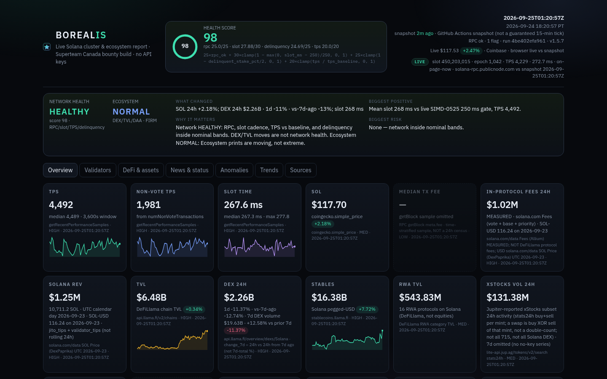

# Borealis

**Version 1.5.5.** 
Live Solana cluster & ecosystem report, **version 1.5.5**. One command, **no API keys**, Python stdlib only (`urllib`).

[](https://dustycompiler.github.io/borealis-solana/)
[](https://github.com/dustycompiler/borealis-solana/actions/workflows/tests.yml)
[](LICENSE)

**Live demo:** https://dustycompiler.github.io/borealis-solana/

**Repo:** https://github.com/dustycompiler/borealis-solana

Desktop snapshot (docs/screenshot.png) is generated by headless Chrome after each run.



```bash
python3 generate.py
```

Writes:

| Path | What |
| --- | --- |
| `out/index.html` | Interactive dark dashboard (self-contained) |
| `out/report.md` | Human-readable report |
| `out/report.json` | Structured metrics + per-source timestamps |
| `docs/` | Static copy for GitHub Pages (including `favicon.svg`) |
| `data/history.jsonl` | Rolling baseline used by the anomaly strip |

Author: **dustycompiler**. License: MIT.

Original work for Superteam Canada's auto-updating Solana report bounty. Inspired by the *idea* of a live pulse dashboard — not a clone of any existing codebase (including any other public dashboard).

---

## Run

Requires Python 3.9+ (3.12/3.13 fine). No `pip install`.

```bash
git clone https://github.com/dustycompiler/borealis-solana
cd borealis-solana
python3 generate.py
python3 -m unittest
```

Open `out/index.html` locally, or the live demo above.

Flags:

```
python3 generate.py --out out --docs docs --history data/history.jsonl
```

Each run **appends** a compact row to `data/history.jsonl` and charts it. If that tape is still short, Trends is seeded from DeFiLlama historical TVL and solana.com/data 30d (TPS = tx count / 86400), so run 1 already shows movement rather than KPI tiles alone.

---

## What is measured

Live JSON-RPC against `https://api.mainnet-beta.solana.com`, falling back to `https://solana-rpc.publicnode.com` on HTTP 429 / 5xx / parse errors.

| Call | Used for |
| --- | --- |
| `getHealth` | Cluster health + health-score RPC term |
| `getSlot` + `getBlockTime` | Slot, block timestamp |
| `getEpochInfo` | Epoch, slot index, block height, epoch % |
| `getRecentPerformanceSamples(60)` | TPS, non-vote TPS, slot time (last sample vs window) |
| `getVoteAccounts` | Active vs delinquent, stake, commission, lag |
| `getSupply` | Circulating / total SOL (also used for derived market cap) |
| `getBalance` | Native SOL at the Foundation-documented incinerator |
| `getSlot` + `getBlocks` + `getBlock` | Median tx fee, **time-stratified**: last ~2 consecutive finalized blocks (spot) plus ~12 slots walked back over a **~2–3h** window. ≤160 txs subsampled per sampled slot. `meta.fee` lamports. All-tx and non-vote p50. Labels `window_seconds`, `not_24h_census`, `n_blocks`, `n_tx`. **NOT a 24h census.** publicnode fallback. Never invented. |

**Derived (not fetched as a named RPC field):**

- TPS = `numTransactions / samplePeriodSecs`
- Non-vote TPS = `numNonVoteTransactions / samplePeriodSecs`
- Slot time = `samplePeriodSecs / numSlots`
- Nakamoto coefficient = fewest current validators whose activated stake exceeds 33% / 50% / 67%
- Lag slots = `getSlot − lastVote`
- 24h % = `(last − open) / open` on Coinbase Exchange SOL-USD stats (Kraken `o` as fallback)

### Market & DeFi (no keys)

- **CoinGecko** `simple/price?ids=solana` — tried first with `Retry-After`. Often 429 from shared CI IPs.
- **Coinbase Exchange** `https://api.exchange.coinbase.com/products/SOL-USD/stats` — **primary 24h** on this project: `last`, `open`, `volume`. 24h % = `(last − open) / open`. Quote volume = `last × base volume`. CORS `*` so the page can also tick live in the browser, labeled **browser live vs snapshot**.
- **Kraken** `https://api.kraken.com/0/public/Ticker?pair=SOLUSD` — fallback 24h using last `c[0]` and 24h open `o`.
- **DeFiLlama coins** `coins.llama.fi/prices/current/coingecko:solana` — price-only fill (no 24h). CORS `*`.
- **solana.com/data** SOL Price 30d series — day-over-day 24h only if the tape above has no change. Labeled as DoD, not a rolling 24h.
- **Binance** is not called (HTTP 451 from this network).
- Market cap: CoinGecko when present, otherwise **derived: price × RPC circulating supply**, labeled as such. Never invented.
- **DeFiLlama** `/v2/chains`, `/v2/historicalChainTvl/Solana`, `/overview/dexs/Solana`, `/overview/fees/Solana`, `/protocols`
- **stablecoins.llama.fi** chain circulating + per-asset Solana supply + 90-day chart
- **RWA** = sum of `chainTvls.Solana` for protocols whose DeFiLlama category is `RWA` or `RWA Lending`. Labeled protocol TVL, **not** a tokenized-equities census (those Llama routes are Pro-only). Shown separately from xStocks.

**Tokenized equities (xStocks)** — public no-key API (`api.backed.fi` then `api.xstocks.fi`). Paginated `/public/assets` plus concurrent `/price-data`, `/circulating-supply`, and `/public/assets/{sym}/multiplier?network=Solana` (stdlib ThreadPoolExecutor, cap 80). Parse `currentMultiplier`. **If the multiplier fetch fails or `currentMultiplier` is missing: multiplier=None, mcap omitted — never silent 1.0.** Coverage: `count_multiplier_ok`, `count_mcap_computable`. **count_meaning:** unique xStocks names with a Solana deployment (catalog; 1:1 with unique underlyings in current API; not every tokenized equity on Solana). **Market cap formula (labeled):** `quote × circulating × live currentMultiplier`, **priced N of M · lower bound — not a 715 census**. **24h activity** is Jupiter lite-api at <=0.5 RPS (query=`xStock` first, per-symbol only for misses; STALE cache <=24h if Jupiter 429s). Jupiter-reported xStocks subset (`stats24h` buy+sell per mint; a swap is buy XOR sell of that mint, not a double-count; not all 715, not all Solana DEX). Jupiter has no 7d stats series and DeFiLlama `protocol/xstocks` has TVL not volume, so **7d volume is omitted** rather than invented. DeFiLlama `protocol/xstocks` Solana TVL is shown as **labeled coverage** (liquidity census, not the priced-subset mcap, not 24h volume) when it answers. Missing quotes/multipliers are omitted, never invented.

**Solana REV (Blockworks/Helius, latest complete UTC calendar day):** in-protocol transaction fees (vote + base + priority) plus out-of-protocol Jito MEV tips, **same UTC date**. Headline is **SOL total + USD**. USD uses that UTC day's `solana.com/data` SOL Price (vendor series; not the live snapshot). Spot equivalent at run SOL-USD is labeled separately and is not the tile. Jito = public no-key `GET https://kobe.mainnet.jito.network/api/v1/daily_mev_rewards`. **Gross tips = `jito_tips + validator_tips`** (Jito-paid/retained vs validator-distributed; not inclusive; we do not treat the split as a TipRouter protocol-fee rate). Today's incomplete Jito row is skipped. Dates are never mixed. This is a UTC calendar day, **not a rolling 24h**. `tip_floor p50 × non-vote TPS × 86400` stays `jito_runrate_not_rev` (`included_in_headline=false`). **DeFiLlama `/overview/fees/Solana` protocol/application fees are listed separately and NEVER summed into REV.** DeFiLlama `summary/fees/jito-mev-tips` is a rolling-24h cross-check, not the addend.

**Burned SOL** is `getBalance` of the Solana Foundation burn address `1nc1nerator11111111111111111111111111111111` (solana.com news, footnote 4). Native SOL in an inaccessible account, not an SPL mint-supply burn.

**Public Dune embed (External Reference)** (Sources tab) iframes cryptoonchain/solana-explorer. Labeled External Reference — public Dune embed, not our query, not a core number. No Dune API key. Do not copy Orbit Dune queries or cache.

### solana.com/data

- `https://solana.com/api/databricks/data?days=30` — Active Addresses, SOL price, fees, tx count, application revenue, …
- `https://solana.com/api/rpc/data` — public RPC latency / error rate by provider

Daily active addresses: headline = Allium, plus the min–max across vendors. Vendor series disagree; Borealis does **not** average them. 30d medians of TPS (tx count / 86400), DAA, and price are used for anomaly flags.

### News / X (no Twitter API key)

Probes live public RSS and keeps what works:

- `xcancel.com/{solana,solana_status,anza_xyz,solana_devs}/rss` (skip whitelist/403)
- Nitter-style `nitter.perennialte.ch/{handle}/rss` as a working public mirror
- `rsshub.app/twitter/user/solana` (often 403 — skipped)
- `status.solana.com/history.atom`, `solana.com/news/rss.xml`, `medium.com/feed/anza-xyz`

Labeled **public X/Nitter-style RSS, not the official Twitter API**. Lightweight keyword tags (`upgrade`, `outage`, `incident`, `mainnet`, `halt`) — not ML.

Items older than 45 days are dropped by the RSS recency filter (`_parse_pub` accepts RFC2822 **and ISO-8601**, so `status.solana.com` `2022-06-01T21:06:03Z` dates parse). Remaining items are bucketed: **active incidents** / **recently resolved** (14d) / **current news** (14d) / **archive**. 2022–2024 status.solana.com outages are not shown as current.

---

## Health score (0–100)

Shown in the hero. Not a mystery number.

```
25×rpc_ok
+ 30×clamp(1 − max(0, slot_ms − 400)/400, 0, 1)
+ 25×clamp(1 − delinquent_stake_pct/2, 0, 1)
+ 20×clamp(tps / tps_baseline, 0, 1)
```

| Term | Max | Meaning |
| --- | --- | --- |
| `rpc_ok` | 25 | 25 if `getHealth == ok`, or if getHealth 429s but slot + TPS RPC succeeded; 0 if RPC unreachable |
| slot | 30 | 400 ms → 30, 800 ms → 0 (faster than 400 still 30) |
| delinquency | 25 | 0% delinquent stake → 25, 2%+ → 0 |
| TPS | 20 | current mean TPS vs 30d median from solana.com/data `Transaction Count / 86400`; falls back to the in-window sample median |

Covered by `tests/test_generate.py`.

**Network Health vs Ecosystem Activity.** The exec verdict is **network** health only: RPC, slot cadence, TPS vs baseline, delinquency, status.solana.com. Labels: `HEALTHY` / `WATCH` / `DEGRADED` / `CRITICAL`. DEX/TVL/DAA moves are **Ecosystem Activity** (`QUIET` / `NORMAL` / `ELEVATED` / `SURGE` / `CONTRACTION`) and cannot paint the network WATCH. A DEX surge is SURGE + HEALTHY when slots and delinquency are quiet. If Network Health is HEALTHY, Biggest risk is always None (DEX/TVL contraction cannot paint network risk). If not HEALTHY, Biggest risk is the classifier's dominant factor (delinquency, slot, RPC) — never "None" under WATCH.

---

## Anomaly detection

Useful **on run 1** (no history.jsonl required). Empty strip copy:

> No flags vs rolling baseline (N samples / llama 7d). Watching.

| Flag | Window | Threshold |
| --- | --- | --- |
| `tps_last_sigma` / `slot_time_last_sigma` | 60 × ~60s samples | last sample vs window mean, \|z\| ≥ 2.5 |
| `slow_slots_500ms` | same | last or mean slot time > 500 ms |
| `high_delinquency` | `getVoteAccounts` | delinquent stake ≥ 1% **or** count ≥ 25 |
| `tvl_move_1d` / `_7d` | DeFiLlama daily TVL | \|1d\| ≥ 8% or \|7d\| ≥ 20% |
| `dex_move_1d` / `_7d` | DeFiLlama DEX | same |
| `fees_move_1d` / `_7d` | DeFiLlama protocol fees (not REV) | same |
| `sol_price_move` | Coinbase/Kraken/CoinGecko 24h | \|24h\| ≥ 8% |
| `tps_vs_30d` / `daa_vs_30d` / `price_vs_30d` | solana.com/data 30d | \|current − median\| / median ≥ 20% |
| `corr_congestion` | multi-source | elevated slot time **and** depressed non-vote TPS **and** fees 1d ≥ 8% |
| `corr_risk_off` | multi-source | SOL 24h < 0 **and** TVL 1d < 0 **and** DEX 1d < 0 |
| `corr_validator_stress` | multi-source | delinquency up **and** lagging vote accounts |
| `rpc_unhealthy` / `status_degraded` | RPC / status.solana.com | not ok |
| `tps_vs_run_history` | `data/history.jsonl` (n ≥ 8) | outside 3σ of prior snapshots |

`history.jsonl` is persisted and charted on the Overview / Anomalies tabs.

---

## Editorial: SIMD-525 (slot-time reduction) + Alpenglow

The Superteam listing asks for **Alpenglow, SIMD-525**. **First-party live status:** [Solana Changelog: August 20, 2026](https://solana.com/news/solana-changelog-august-20-2026) — “Feature gates reduced mainnet slot times from 400ms to 350ms, while Testnet moved from 250ms to 200ms.” Borealis labels each stage from **on-chain Feature accounts** (`getAccountInfo`, `effective_epoch = epoch(activated_slot) + 1`), not from observed slot milliseconds. Observed ~367 ms is **INFERRED corroboration**, never gate proof. Do not copy [solana.com/upgrades/reduced-slot-times](https://solana.com/upgrades/reduced-slot-times) if it still lists 400 ms. Listing-token write-up: [“Lowering Slot Time and Validators Economic”](https://solana.com/news/lowering-slot-time-and-validators-economic). **Alpenglow consensus is SIMD-0326** (separate track).

The Overview tab carries a dated upgrade tracker with the exact listing token `SIMD-525` and per-stage labels (`live` / `activated-not-yet-effective` / `pending`). See `editorial` and `simd0525_gates` in `report.json`.

---

## Automation

### GitHub Action (scheduled auto-refresh)

`.github/workflows/update.yml` runs `python3 -m unittest` then `python3 generate.py` on a GitHub Actions `schedule` plus `workflow_dispatch` (and on generator-path pushes to main), then commits `out/`, `docs/`, and `data/history.jsonl` as **dustycompiler** (`dustycompiler@users.noreply.github.com`). Enable Actions on the repo. No secrets required.

**Honest cadence:** GitHub's `*/15 * * * *` line is **not** a guaranteed 15-minute tick. It has drifted to ~2 hours and has paused for a day. The live dashboard does **not** claim 15-minute updates. A **STALE** banner appears when `generated_at` is older than **2 hours**. Manual `workflow_dispatch` is the reliable refresh. Do not add another in-repo cron.

**On-page LIVE pulse (1.5.5):** the dashboard JS JSON-RPC-calls public Solana RPC on load and at most every 60s (`getEpochInfo`, `getRecentPerformanceSamples(1)`, `getSlot`) for slot, epoch, TPS, and slot-time. Labeled **LIVE / on-page-now** vs snapshot `generated_at`. If RPC fails, last snapshot values render as **NOT LIVE** — numbers are never invented. Endpoints are the same keyless pair as generate.py, publicnode first (GitHub Pages Origin is 403'd by `api.mainnet-beta.solana.com`). This is how the page stays alive without burning Actions minutes.

### GitHub Pages

Settings → Pages → Deploy from branch → `/docs`. `docs/index.html` is the dashboard. `docs/.nojekyll` is included so GitHub does not run Jekyll. Favicon + Open Graph tags ship with the snapshot.

### Local cron (optional)

See `crontab.example`. That file is a **local** optional `*/15` loop. It is **not** how GitHub Pages is refreshed.

---

## Honest sources table

| Metric | Source | Key | Label |
| --- | --- | --- | --- |
| TPS / slot | getRecentPerformanceSamples | no | derived |
| SOL 24h | Coinbase stats, Kraken, CoinGecko | no | (last-open)/open |
| Market cap | CoinGecko or price x circulating | no | derived when not Gecko |
| TVL / DEX / protocol fees | DeFiLlama | no | fees 24h = protocol fees, not REV |
| Median tx fee | RPC getBlock meta.fee | no | p50/p90/p99, n, slot range |
| Tokenized equities | xStocks public API + live multiplier | no | mcap = quote × circulating × currentMultiplier (omitted if missing) |
| DAA / 30d TPS / 30d SOL | solana.com/data | no | vendors not averaged |
| Burned SOL | incinerator getBalance | no | Foundation burn address |
| X RSS | xcancel / nitter / rsshub | no | not Twitter API |
| Dune panel | public dashboard iframe (External Reference) | no | public Dune embed, not our query; not core |

## Integrity rules

- No API keys, no scraping of authenticated dashboards.
- If a source 429s or 5xxs after retries, the tile is omitted and `omissions[]` explains why.
- Every fetch is logged in `report.json` → `sources[]` with URL, HTTP status, bytes, milliseconds, UTC timestamp — including failures.
- User-Agent: `BorealisReport/1.5.5 (Solana ecosystem dashboard; stdlib urllib; no API key)`.

## Layout

```
generate.py          orchestrator (RPC, HTTP, anomalies, markdown, json)
htmlout.py           dark dashboard renderer (inline CSS/JS, SVG trend charts)
tests/test_generate.py
out/                 latest generated artifacts
docs/                GitHub Pages snapshot (copy of out/)
data/history.jsonl   rolling baselines
.github/workflows/update.yml
crontab.example
```

## Tests

Stdlib unittest. No pip, no network.

    python3 -m unittest

Covers health-score formula, 24h percent (last-open)/open, anomaly flags on synthetic series, RSS recency (ISO + RFC2822; 2022 incidents not current), fee percentiles + `window_seconds` + `not_24h_census`, xStocks mcap formula + **live `/multiplier?network=Solana` `currentMultiplier`** (missing → mcap omitted, never silent 1.0), REV = same UTC day fees + gross Jito MEV (jito_tips+validator_tips); llama protocol fees excluded; Jito tip-floor run-rate is not headline REV, SIMD-525 Feature-gate labels from getAccountInfo (not observed slot ms), DEX surge or contraction → HEALTHY with biggest_risk None, WATCH/DEGRADED/CRITICAL biggest_risk from dominant network sentence, RPC 429 → publicnode fallback, and CoinGecko 429 → Coinbase (expected unavailable, not a raw 108/132 headline).

---

## Judge rubric

| Requirement | Implementation | Source | Dashboard location | Test |
| --- | --- | --- | --- | --- |
| Live cluster TPS / slot / health | `getHealth`, `getRecentPerformanceSamples` | Solana JSON-RPC + publicnode fallback | Overview KPI tiles | `HealthScoreTests` |
| SOL 24h | `(last − open) / open` | Coinbase stats, Kraken fallback, CoinGecko first | SOL tile | `Pct24hTests` |
| Health score 0–100 | published 25/30/25/20 formula | RPC + 30d TPS baseline | Hero + Overview | `HealthScoreTests` |
| Anomalies on run 1 | Llama 1d/7d + 30d medians + z-scores | DeFiLlama, solana.com/data, RPC samples | Anomaly strip | `AnomalyTests` |
| Median tx fee | time-stratified getBlock (spot + ~2–3h samples), `window_seconds` + `not_24h_census` | Solana RPC | Median tx fee tile + Economics panel | `FeeStatsTests`, `FeeWindowTests`, `FeeCensusLabelTests` |
| Tokenized equities | xStocks public assets + price-data + live `/multiplier?network=Solana`; Jupiter `stats24h` subset activity; mcap = quote × circ × currentMultiplier (omitted if missing) | api.backed.fi / jup.ag lite-api | xStocks vol + mcap tiles | `EquityMcapTests`, `MultiplierFetchTests` |
| In-protocol fees / Solana REV | MEASURED same-UTC-day fees + gross Jito MEV; USD uses that day's solana.com/data SOL Price; llama protocol fees EXCLUDED; tip-floor not REV | solana.com/data Fees + SOL Price + kobe.mainnet.jito.network daily_mev_rewards | Solana REV tile (SOL + USD + UTC date) | `EconomicsHonestyTests` |
| Exec view | Network HEALTHY/WATCH/DEGRADED/CRITICAL **separate from** Ecosystem QUIET/NORMAL/ELEVATED/SURGE; risk only if adverse | RPC + validators vs DEX/TVL | Top of dashboard | `InsightBriefTests` |
| SIMD-525 tracker | listing token + Feature-gate labels (live / activated-not-yet-effective / pending) | changelog 2026-08-20 + getAccountInfo | Overview editorial | `Simd525Tests` |
| Intelligence | 3–6 evidence-linked lines, no LLM | same snapshot | Intelligence panel | `InsightBriefTests` |
| Charts 24h/7d/30d/90d | SVG + range buttons; seed from Llama 90d + solana.com 30d | history.jsonl + public historical | Trends | generate.py live |
| Source · age · confidence | every headline tile | `sources[]` + snapshot time | KPI meta-line | htmlout provenance |
| Scheduled Action, GH Pages | unittest then generate; STALE banner if snapshot age > 2h; commit as dustycompiler noreply | GitHub Actions | live demo | `.github/workflows` |
| Stdlib, no keys | urllib only in `generate.py` | — | — | no pip in workflow |

Architecture: `generate.py` fetches and scores; `htmlout.py` renders a self-contained dark page; `data/history.jsonl` is the rolling tape. Methodology: never invent a missing number — omit the tile and record the miss in `omissions[]` / `sources[]`.
